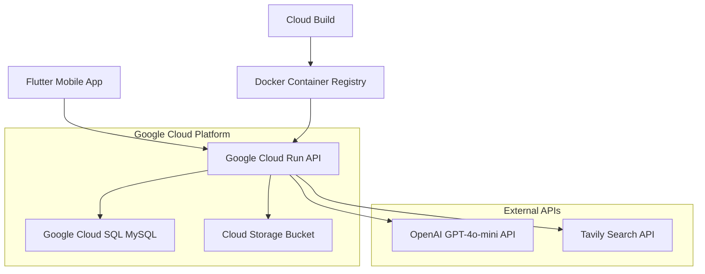

# 📚 Study Buddy Cloud - Full-Stack Academic Assistant

> 🚀 A cloud-native mobile productivity app helping students manage courses, assignments, study sessions, grades, and AI tutoring. Now powered by **Google Cloud Platform** with global accessibility.

[](https://flutter.dev)
[](https://nodejs.org)
[](https://cloud.google.com)
[](https://www.mysql.com)
[](LICENSE)

---

## 📋 Table of Contents

- [🌟 What's New in Cloud Branch](#-whats-new-in-cloud-branch)
- [📖 Overview](#-overview)
- [✨ Features](#-features)
  - [🎓 Core App Features](#-core-app-features)
  - [🤖 AI Assistant Module](#-ai-assistant-module)
- [🏗️ Cloud Architecture](#️-cloud-architecture)
- [🛠️ Tech Stack](#️-tech-stack)
- [📁 Project Structure](#-project-structure)
- [🚀 Setup Guide](#-setup-guide)
- [🔌 API Endpoints](#-api-endpoints)
- [🗄️ Database Schema](#️-database-schema)
- [🧭 Usage Guide](#-usage-guide)
- [💰 Cost Analysis](#-cost-analysis)
- [🐛 Troubleshooting](#-troubleshooting)
- [🤝 Contributing](#-contributing)
- [📄 License](#-license)

---

## 🌟 What's New in Cloud Branch

### ☁️ **Fully Cloud-Native Architecture**
- **Google Cloud SQL** - Production-ready MySQL database with automatic backups
- **Google Cloud Run** - Serverless backend hosting with auto-scaling
- **Global Accessibility** - Works from anywhere, no more localhost limitations
- **Team Collaboration** - Shared backend for seamless team development

### 🚀 **Production-Ready Deployment**
- **Single-Command Deployment** - One `gcloud` command deploys the entire backend
- **Environment Variables** - Secure configuration management
- **Docker Containerization** - Consistent deployment across environments
- **SSL/HTTPS** - Secure communication by default

### 🔧 **Development Improvements**
- **No More Local Backend** - Just run `flutter run`, no need for `npm start`
- **Real Device Testing** - Works on physical devices out of the box
- **Platform Agnostic** - Same backend URL for Android, iOS, and web

---

## 📖 Overview

Study Buddy Cloud is a complete evolution of the original Study Buddy app, now deployed on Google Cloud Platform for production-scale reliability and global accessibility. The app integrates comprehensive academic management with an intelligent AI tutor powered by OpenAI GPT-4o-mini.

**Core Capabilities:**
- 📚 Course and assignment management
- ⏱️ Study session tracking with analytics
- 📊 Advanced grade calculation with what-if scenarios
- 🤖 Multi-modal AI tutoring (text, images, web research)
- 🔐 Secure JWT authentication
- ☁️ Cloud-native architecture with 99.9% uptime

---

## ✨ Features

### 🎓 Core App Features

#### 👤 **Authentication & Security**
- Secure user registration and login
- JWT-based authentication with refresh tokens
- Password hashing with bcrypt
- Persistent sessions via SharedPreferences
- Role-based access control

#### 📚 **Course Management**
- Create, edit, and delete courses
- Instructor and semester tracking
- Course-specific assignment filtering
- Academic level categorization
- Semester-based organization

#### 📝 **Assignment Tracking**
- Comprehensive assignment lifecycle management
- Priority levels (Low, Medium, High, Critical)
- Status tracking: Not Started → In Progress → Completed
- Due date management with smart notifications
- Rich text descriptions and file attachments
- Assignment upload and download functionality

#### ⏱️ **Study Session Analytics**
- Start/stop time tracking with precision
- Planned vs actual duration analysis
- Productivity metrics and insights

#### 📊 **Advanced Grade Calculator**
- Weighted grade categories with custom weights
- What-if scenario planning for final grades
- Export functionality for academic records

#### 📱 **Modern Mobile UI/UX**
- Material Design 3 implementation
- Responsive layouts for all screen sizes
- Intuitive swipe actions and gestures
- Dark/light theme support
- Accessibility features compliance

### 🤖 AI Assistant Module
-  **Multi-conversation support** - Create and manage multiple chat sessions
- **Persistent chat history** - All conversations saved to MySQL database
- **Auto-generated titles** - AI automatically names your chats based on content
- **Manual title editing** - Rename chats anytime with tap-to-edit

#### 💬 **Conversational Intelligence**
- **Multi-conversation Management** - Create unlimited chat sessions
- **Persistent History** - All conversations stored in cloud database
- **Auto-generated Titles** - AI automatically names chats based on content
- **Manual Title Editing** - Rename chats anytime with intuitive interface
- **Context Awareness** - AI maintains conversation context across sessions

#### 🖼️ **Multi-modal Image Understanding**
- **Bulk Image Upload** - Send multiple images in a single message
- **Advanced Image Analysis** - Describe, analyze, solve problems from images
- **Thumbnail Previews** - See uploaded images before sending
- **Full-screen Zoom** - Tap images for detailed viewing with pinch-to-zoom
- **Image Format Support** - JPG, PNG, GIF, WebP compatibility

#### 🔬 **Real-time Web Research**
- **Live Web Search** - AI searches current information using Tavily API
- **Source Citations** - Every researched answer includes clickable references
- **Beyond Training Data** - Access to real-time information past AI's knowledge cutoff
- **Research Mode Toggle** - Enable/disable based on query requirements
- **Fact Verification** - Cross-reference multiple sources for accuracy

#### 🧩 **Intelligent Response System**
- **Markdown Rendering** - Rich text with **bold**, *italic*, lists, `code blocks`
- **Structured Responses** - Organized answers for complex queries
- **Code Syntax Highlighting** - Programming language support
- **Mathematical Notation** - LaTeX rendering for equations
- **Optimistic UI Updates** - Instant feedback while processing

---

## 🏗️ Cloud Architecture



### 🔄 **Deployment Pipeline**
1. **Source Code** → Google Cloud Build
2. **Docker Build** → Container Registry
3. **Deploy** → Cloud Run Service
4. **Database** → Cloud SQL Instance
5. **Static Assets** → Cloud Storage

### 🌐 **Global Infrastructure**
- **Multi-region Support** - Deploy in us-central1, europe-west1, or asia-northeast1
- **Auto-scaling** - Scales from 0 to 1000+ concurrent users
- **Load Balancing** - Built-in Google Cloud Load Balancer
- **CDN Integration** - Google Cloud CDN for static assets

---

## 🛠️ Tech Stack

### Frontend (Flutter)
```yaml
dependencies:
  flutter: sdk: flutter
  http: ^1.1.0                    # API communication
  shared_preferences: ^2.2.2      # Local token storage
  file_picker: ^8.0.0            # Image/file selection
  flutter_markdown: ^0.7.4       # Rich text rendering
  url_launcher: ^6.2.0           # Open research sources
  intl: ^0.19.0                  # Internationalization
  http_parser: ^4.0.2            # MIME type handling
```

### Backend (Node.js)
```json
{
  "dependencies": {
    "express": "^4.18.2",         
    "mysql2": "^3.6.0",           
    "openai": "^4.20.0",          
    "jsonwebtoken": "^9.0.2",     
    "multer": "^1.4.5-lts.1",     
    "dotenv": "^16.3.1",          
    "cors": "^2.8.5",             
    "axios": "^1.6.0",            
    "bcryptjs": "^2.4.3"          
  }
}
```

### Cloud Infrastructure
- **🗄️ Database**: Google Cloud SQL (MySQL 8.0)
- **🚀 Hosting**: Google Cloud Run (Serverless)
- **🐳 Containerization**: Docker with Alpine Linux
- **🔐 Security**: HTTPS/SSL, VPC, IAM roles
- **📊 Monitoring**: Cloud Logging, Cloud Monitoring
- **💾 Storage**: Cloud Storage for file uploads

---

## 📁 Project Structure

```
study_buddy_cloud/
├── frontend/ (Flutter)
│   ├── lib/
│   │   ├── screens/
│   │   │   ├── login_screen.dart           # Authentication UI
│   │   │   ├── course_screen.dart          # Course management
│   │   │   ├── assignment_screen.dart      # Assignment tracking
│   │   │   ├── study_session_screen.dart   # Session logging
│   │   │   ├── grade_calculator_screen.dart # Grade analytics
│   │   │   ├── chat_list_screen.dart       # AI chat list
│   │   │   └── ai_tutor_screen.dart        # AI conversation
│   │   ├── services/
│   │   │   └── api_service.dart            # Cloud API client
│   │   ├── models/                         # Data models
│   │   └── widgets/                        # Reusable UI components
│   └── pubspec.yaml
│
├── backend/ (Node.js)
│   ├── src/
│   │   ├── config/
│   │   │   └── db.js                       # Cloud SQL connection
│   │   ├── controllers/
│   │   │   ├── authController.js           # JWT authentication
│   │   │   ├── courseController.js         # Course CRUD operations
│   │   │   ├── assignmentController.js     # Assignment management
│   │   │   ├── gradeController.js          # Grade calculations
│   │   │   ├── studySessionController.js   # Session tracking
│   │   │   ├── conversationController.js   # AI chat management
│   │   │   ├── messageController.js        # AI message processing
│   │   │   └── uploadController.js         # File upload handling
│   │   ├── routes/
│   │   │   ├── authRoutes.js              # Authentication endpoints
│   │   │   ├── courseRoutes.js            # Course API routes
│   │   │   ├── assignmentRoutes.js        # Assignment API routes
│   │   │   ├── gradeRoutes.js             # Grade API routes
│   │   │   ├── studySessionRoutes.js      # Session API routes
│   │   │   └── aiRoutes.js                # AI chat endpoints
│   │   ├── middleware/
│   │   │   └── authMiddleware.js          # JWT verification
│   │   ├── services/
│   │   │   ├── openaiService.js           # OpenAI integration
│   │   │   └── tavilyService.js           # Web search service
│   │   └── server.js                      # Express app entry point
│   ├── uploads/                           # File storage directory
│   ├── Dockerfile                         # Container configuration
│   ├── .dockerignore                      # Docker ignore patterns
│   └── package.json                       # Node.js dependencies
│
├── database/
│   └── schema.sql                         # Complete database schema
│
└── deployment/
    ├── cloudbuild.yaml                    # Google Cloud Build config
    └── app.yaml                           # App Engine config (optional)
```

---

## 🚀 Setup Guide 

### ⚠️ IMPORTANT: No Backend Setup Required
This app uses a **cloud-based backend** that is already deployed and running. You only need to run the Flutter frontend app.

### Prerequisites

#### 1. **Install Android Studio**
- Download from: https://developer.android.com/studio
- During installation, make sure to install:
  - Android SDK
  - Android SDK Platform-Tools
  - Android SDK Build-Tools
  - Android Virtual Device (AVD)

#### 2. **Install Flutter SDK**
- Download from: https://docs.flutter.dev/get-started/install
- **Windows**: Download Flutter SDK ZIP → Extract to `C:\flutter` → Add `C:\flutter\bin` to PATH
- **macOS**: Download Flutter SDK ZIP → Extract to `/Users/[username]/flutter` → Add to PATH
- **Linux**: Download Flutter SDK → Extract → Add to PATH

#### 3. **Verify Installation**
Open terminal/command prompt and run:
```bash
flutter doctor
```
**Expected output should show:**
```
✓ Flutter (Channel stable, 3.x.x)
✓ Android toolchain - develop for Android devices
✓ Android Studio (version 2022.x or newer)
```

### 🎯 Running the Study Buddy App

#### Step 1: Extract Project Files
- **Unzip** the submitted project folder
- You should see a folder structure like:
  ```
  study_buddy_cloud/
  ├── frontend/          ← This is what you need
  ├── backend/           ← Ignore this folder
  └── database/          ← Ignore this folder
  ```

#### Step 2: Open Terminal/Command Prompt
- **Windows**: Press `Win + R`, type `cmd`, press Enter
- **macOS**: Press `Cmd + Space`, type `Terminal`, press Enter
- **Linux**: Press `Ctrl + Alt + T`

#### Step 3: Navigate to Frontend Directory
```bash
cd path/to/extracted/study_buddy_cloud/frontend
```
**Example:**
- **Windows**: `cd C:\Users\Professor\Downloads\study_buddy_cloud\frontend`
- **macOS**: `cd /Users/Professor/Downloads/study_buddy_cloud/frontend`

#### Step 4: Install Flutter Dependencies
```bash
flutter pub get
```
**Expected output:**
```
Running "flutter pub get" in frontend...
Resolving dependencies...
Got dependencies!
```

#### Step 5: Start Android Emulator
**Option A - Using Android Studio:**
1. Open Android Studio
2. Click "More Actions" → "Virtual Device Manager"
3. Click "Create Device" if no emulator exists
4. Select any phone (e.g., "Pixel 7") → Next
5. Select API Level 34 or higher → Download if needed → Next
6. Click "Finish"
7. Click the ▶️ Play button to start emulator

**Option B - Using Command Line:**
```bash
flutter emulators --launch 
```

#### Step 6: Run the App
**Make sure you're still in the `frontend/` directory, then run:**
```bash
flutter run
```

**Expected behavior:**
- App will compile and launch on the emulator
- You'll see the Study Buddy login screen
- **The app will automatically connect to the cloud backend**
- All features (registration, login, AI chat, courses) will work

### 🎉 Testing the App

1. **Create Account**: Tap "Register" → Fill in details → Submit
2. **Login**: Use the credentials you just created
3. **Test Core Features**:
   - Add a course in the "Courses" tab
   - Create an assignment
   - Start a study session
   - Try the AI chat feature
4. **Test AI Features**:
   - Go to "AI Tutor" tab
   - Create a new chat
   - Ask any question (e.g., "Explain photosynthesis")
   - The AI should respond normally

### ❌ What NOT to Do

- **DO NOT** try to run any backend code
- **DO NOT** install Node.js or npm
- **DO NOT** try to set up any databases
- **DO NOT** modify any configuration files
- **DO NOT** run commands in the `backend/` folder

### 🆘 Troubleshooting

#### Problem: "Flutter command not found"
**Solution:** Flutter is not in your PATH. Reinstall Flutter and add to PATH.

#### Problem: "No connected devices"
**Solution:** Start an Android emulator first (see Step 5).

#### Problem: App shows errors about "network" or "connection"
**Solution:** This is expected if internet is slow. The app connects to Google Cloud - just wait a moment and try again.

#### Problem: "flutter pub get" fails
**Solution:** Run `flutter clean` then `flutter pub get` again.

#### Problem: App builds but crashes immediately
**Solution:** 
1. Make sure you're using Android SDK API 34 or higher
2. Try `flutter clean` then `flutter run` again
3. Check that the emulator has enough memory (4GB+ recommended)

### ✅ Expected Final Result

- ✅ App launches successfully
- ✅ Can register new user account  
- ✅ Can login with created credentials
- ✅ All tabs (Courses, Assignments, Study Sessions, Grades, AI Tutor) are accessible
- ✅ AI chat responds to questions
- ✅ Can upload images to AI chat
- ✅ Can create courses and assignments

**Total setup time: 10-15 minutes (excluding downloads)**

---

### 📞 If You Need Help

If the app doesn't work after following these **exact steps**:

1. **Check your Flutter installation**: Run `flutter doctor -v`
2. **Check your Android setup**: Make sure Android Studio can create/run emulators
3. **Try on a different emulator**: Create a new virtual device with higher API level
4. **Check internet connection**: The app needs internet to connect to the cloud backend

**Remember**: You are only running the **frontend Flutter app**. The backend is already running in Google Cloud and requires no setup from you.

---

## 🔌 API Endpoints

### Authentication

| Method | Endpoint | Description | Auth Required |
|--------|----------|-------------|---------------|
| `POST` | `/api/auth/register` | Register new user | ❌ |
| `POST` | `/api/auth/login` | User login + JWT | ❌ |
| `POST` | `/api/auth/refresh` | Refresh JWT token | ✅ |
| `POST` | `/api/auth/logout` | Logout user | ✅ |

### Course Management

| Method | Endpoint | Description | Auth Required |
|--------|----------|-------------|---------------|
| `GET` | `/api/courses` | List user's courses | ✅ |
| `POST` | `/api/courses` | Create new course | ✅ |
| `PUT` | `/api/courses/:id` | Update course | ✅ |
| `DELETE` | `/api/courses/:id` | Delete course | ✅ |

### Assignment Tracking

| Method | Endpoint | Description | Auth Required |
|--------|----------|-------------|---------------|
| `GET` | `/api/assignments` | List assignments | ✅ |
| `POST` | `/api/assignments` | Create assignment | ✅ |
| `PUT` | `/api/assignments/:id` | Update assignment | ✅ |
| `DELETE` | `/api/assignments/:id` | Delete assignment | ✅ |
| `POST` | `/api/assignments/:id/upload` | Upload assignment file | ✅ |

### Study Sessions

| Method | Endpoint | Description | Auth Required |
|--------|----------|-------------|---------------|
| `GET` | `/api/sessions` | List study sessions | ✅ |
| `POST` | `/api/sessions` | Create/start session | ✅ |
| `PUT` | `/api/sessions/:id` | Update/end session | ✅ |
| `DELETE` | `/api/sessions/:id` | Delete session | ✅ |

### Grade Calculator

| Method | Endpoint | Description | Auth Required |
|--------|----------|-------------|---------------|
| `POST` | `/api/grades/calculate` | Calculate current grade | ✅ |
| `POST` | `/api/grades/what-if` | What-if scenario analysis | ✅ |
| `GET` | `/api/grades/trends` | Grade trends over time | ✅ |

### AI Assistant

#### Conversations
| Method | Endpoint | Description | Auth Required |
|--------|----------|-------------|---------------|
| `POST` | `/api/ai/chats` | Create new chat | ✅ |
| `GET` | `/api/ai/chats` | List user's chats | ✅ |
| `GET` | `/api/ai/chats/:id` | Get chat details | ✅ |
| `POST` | `/api/ai/chats/:id/archive` | Archive/delete chat | ✅ |
| `POST` | `/api/ai/chats/:id/title` | Auto-generate or set title | ✅ |

#### Messages
| Method | Endpoint | Description | Auth Required |
|--------|----------|-------------|---------------|
| `GET` | `/api/ai/chats/:id/messages` | Get chat messages | ✅ |
| `POST` | `/api/ai/chats/:id/messages` | Send message (text/images) | ✅ |

#### File Uploads
| Method | Endpoint | Description | Auth Required |
|--------|----------|-------------|---------------|
| `POST` | `/api/ai/uploads` | Upload image/file | ✅ |
| `GET` | `/api/ai/uploads/:id` | Retrieve attachment | ✅ |
| `DELETE` | `/api/ai/uploads/:id` | Delete attachment | ✅ |

---

## 🗄️ Database Schema

### Core Tables

#### `users`
```sql
CREATE TABLE users (
  user_id INT PRIMARY KEY AUTO_INCREMENT,
  email VARCHAR(255) UNIQUE NOT NULL,
  password_hash VARCHAR(255) NOT NULL,
  first_name VARCHAR(100) NOT NULL,
  last_name VARCHAR(100) NOT NULL,
  academic_level ENUM('undergraduate', 'graduate', 'postgraduate') DEFAULT 'undergraduate',
  created_at TIMESTAMP DEFAULT CURRENT_TIMESTAMP,
  updated_at TIMESTAMP DEFAULT CURRENT_TIMESTAMP ON UPDATE CURRENT_TIMESTAMP,
  is_active BOOLEAN DEFAULT TRUE
);
```

#### `courses`
```sql
CREATE TABLE courses (
  course_id INT PRIMARY KEY AUTO_INCREMENT,
  user_id INT NOT NULL,
  course_name VARCHAR(255) NOT NULL,
  course_code VARCHAR(50),
  instructor VARCHAR(255),
  semester VARCHAR(100),
  credits INT DEFAULT 3,
  created_at TIMESTAMP DEFAULT CURRENT_TIMESTAMP,
  FOREIGN KEY (user_id) REFERENCES users(user_id) ON DELETE CASCADE
);
```

#### `assignments`
```sql
CREATE TABLE assignments (
  assignment_id INT PRIMARY KEY AUTO_INCREMENT,
  course_id INT NOT NULL,
  user_id INT NOT NULL,
  title VARCHAR(255) NOT NULL,
  description TEXT,
  priority ENUM('low', 'medium', 'high', 'critical') DEFAULT 'medium',
  status ENUM('not_started', 'in_progress', 'completed') DEFAULT 'not_started',
  due_date DATETIME,
  file_path VARCHAR(500),
  created_at TIMESTAMP DEFAULT CURRENT_TIMESTAMP,
  updated_at TIMESTAMP DEFAULT CURRENT_TIMESTAMP ON UPDATE CURRENT_TIMESTAMP,
  FOREIGN KEY (course_id) REFERENCES courses(course_id) ON DELETE CASCADE,
  FOREIGN KEY (user_id) REFERENCES users(user_id) ON DELETE CASCADE
);
```

### AI Chat Tables

#### `conversations`
```sql
CREATE TABLE conversations (
  id BIGINT UNSIGNED PRIMARY KEY AUTO_INCREMENT,
  user_id INT NOT NULL,
  title VARCHAR(120) DEFAULT NULL,
  openai_thread_id VARCHAR(128) UNIQUE,
  archived TINYINT(1) DEFAULT 0,
  created_at TIMESTAMP DEFAULT CURRENT_TIMESTAMP,
  updated_at TIMESTAMP DEFAULT CURRENT_TIMESTAMP ON UPDATE CURRENT_TIMESTAMP,
  is_archived TINYINT(1) DEFAULT 0,
  FOREIGN KEY (user_id) REFERENCES users(user_id) ON DELETE CASCADE
);
```

#### `messages`
```sql
CREATE TABLE messages (
  id BIGINT UNSIGNED PRIMARY KEY AUTO_INCREMENT,
  conversation_id BIGINT UNSIGNED NOT NULL,
  role ENUM('user', 'assistant', 'system') NOT NULL,
  text MEDIUMTEXT NOT NULL,
  openai_message_id VARCHAR(128),
  token_count INT UNSIGNED,
  sources JSON,
  created_at TIMESTAMP DEFAULT CURRENT_TIMESTAMP,
  FOREIGN KEY (conversation_id) REFERENCES conversations(id) ON DELETE CASCADE
);
```

#### `attachments`
```sql
CREATE TABLE attachments (
  id BIGINT UNSIGNED PRIMARY KEY AUTO_INCREMENT,
  conversation_id BIGINT UNSIGNED NOT NULL,
  user_id INT NOT NULL,
  message_id BIGINT UNSIGNED,
  file_path VARCHAR(500) NOT NULL,
  file_name VARCHAR(255) NOT NULL,
  mime_type VARCHAR(100),
  file_size BIGINT UNSIGNED,
  kind ENUM('image', 'document', 'assignment') DEFAULT 'image',
  created_at TIMESTAMP DEFAULT CURRENT_TIMESTAMP,
  FOREIGN KEY (conversation_id) REFERENCES conversations(id) ON DELETE CASCADE,
  FOREIGN KEY (user_id) REFERENCES users(user_id) ON DELETE CASCADE,
  FOREIGN KEY (message_id) REFERENCES messages(id) ON DELETE CASCADE
);
```

---

## 🧭 Usage Guide

### Getting Started

1. **User Registration**
   - Launch the app
   - Tap "Create Account"
   - Fill in your details (email, password, name, academic level)
   - Verify email if required
   - Login automatically

2. **Managing Assignments**
   - Select a course or go to "Assignments" tab
   - Tap "Add Assignment"
   - Set priority, due date, and description
   - Upload files if needed
   - Track progress with status updates

### AI Assistant Features

#### Creating AI Chats
1. Navigate to "AI Tutor" tab
2. Tap the "+" button to create a new chat
3. Chat appears immediately with "New Chat" title
4. Start asking questions
5. Title auto-generates after the first message

#### Using Research Mode
1. In any chat, tap the 🔬 research icon in the app bar
2. Icon turns yellow when research mode is enabled
3. Ask questions requiring current information
4. AI will search the web and provide sources
5. Click on source links to read full articles

#### Image Analysis
1. In a chat, tap the 📎 attachment icon
2. Select one or multiple images from gallery/camera
3. Preview images appear below the text field
4. Send with or without additional text
5. AI analyzes images and provides detailed responses

#### Managing Chat History
- **View All Chats**: Access from the main AI tutor screen
- **Rename Chats**: Tap the title in the app bar to edit
- **Delete Chats**: Swipe left on any chat and confirm deletion
- **Archive Chats**: Long press and select archive option

### Study Session Tracking

1. **Start a Session**
   - Go to "Study Sessions" tab
   - Tap "Start Session"
   - Select the course you're studying
   - Set planned duration (optional)
   - Tap "Start"

2. **During a Session**
   - Timer shows elapsed time
   - Add notes about what you're studying
   - Pause/resume as needed
   - Upload study materials

3. **End a Session**
   - Tap "End Session"

### Grade Calculator

1. **Set Up Grade Categories**
   - Navigate to a course
   - Tap "Grades" tab
   - Add categories (exams, homework, participation, etc.)
   - Set weights for each category

2. **Input Grades**
   - Select a category
   - Add individual grade items
   - Enter scores as percentages or points
   - View real-time GPA updates

3. **What-If Analysis**
   - Tap "What-If" mode
   - Adjust potential future grades
   - See impact on final grade
   - Plan required scores for target GPA

---

## 💰 Cost Analysis

### Monthly Operational Costs

#### **Development/Testing (Minimal Usage)**
- **Cloud SQL (db-f1-micro)**: $7-10/month
- **Cloud Run**: $0-2/month (within free tier)
- **Cloud Storage**: $0-1/month
- **OpenAI API**: $5-15/month (depending on usage)
- **Tavily API**: $0-5/month (500 free searches)
- **Total**: **$12-33/month**

#### **Production (100-500 Users)**
- **Cloud SQL (db-n1-standard-1)**: $50-60/month
- **Cloud Run**: $10-25/month
- **Cloud Storage**: $2-5/month
- **OpenAI API**: $50-150/month
- **Tavily API**: $20-50/month
- **Total**: **$132-290/month**

#### **Scale (1000+ Users)**
- **Cloud SQL (db-n1-standard-2)**: $100-120/month
- **Cloud Run**: $50-100/month
- **Cloud Storage**: $5-15/month
- **OpenAI API**: $200-500/month
- **Tavily API**: $100-200/month
- **Total**: **$455-935/month**

### Cost Optimization Strategies

1. **Use Free Tiers**
   - Cloud Run: 2M requests/month free
   - Cloud SQL: Consider managed instance scheduling
   - Cloud Storage: 5GB free storage

2. **Optimize AI Usage**
   - Implement response caching
   - Use OpenAI's cheaper models for simple queries
   - Enable research mode only when needed

3. **Database Optimization**
   - Start with smaller instance, scale up as needed
   - Implement connection pooling
   - Use read replicas for analytics queries

4. **Monitor and Alert**
   - Set up billing alerts
   - Monitor API usage patterns
   - Implement rate limiting for expensive operations

---

## 🐛 Troubleshooting

### Authentication Issues

#### **401 Unauthorized Errors**
```
📥 Error: Access denied (401)
```

**Common Causes:**
- JWT token expired or missing
- Auth token not loaded on app startup
- Wrong SharedPreferences key

**Solutions:**
```dart
// Ensure token is loaded in main.dart
void main() async {
  WidgetsFlutterBinding.ensureInitialized();
  await ApiService.loadAuthToken(); // ← Critical
  runApp(MyApp());
}

// Debug token loading
print('🔑 Token loaded: ${ApiService.authToken != null}');

// Check SharedPreferences key
final prefs = await SharedPreferences.getInstance();
final token = prefs.getString('authToken'); // Must be 'authToken'
```

### Database Connection Issues

#### **Cloud SQL Connection Timeouts**
```
Error: connect ETIMEDOUT
```

**Solutions:**
1. **Check Authorized Networks**
   ```bash
   gcloud sql instances patch study-buddy-db \
     --authorized-networks=0.0.0.0/0
   ```

2. **Verify Environment Variables**
   ```bash
   gcloud run services describe study-buddy-backend \
     --region=us-central1 \
     --format="export"
   ```

3. **Test Direct Connection**
   ```bash
   mysql -h YOUR_CLOUD_SQL_IP -u studybuddy -p study_buddy
   ```

### Image Upload Issues

#### **File Upload Failures (application/octet-stream)**
```
Error: File type application/octet-stream not supported
```

**Solution:**
```dart
// Add http_parser dependency in pubspec.yaml
dependencies:
  http_parser: ^4.0.2

// Fix MIME type detection
import 'package:http_parser/http_parser.dart';

request.files.add(
  await http.MultipartFile.fromPath(
    'file',
    filePath,
    contentType: MediaType.parse('image/jpeg'), // Explicit MIME type
  ),
);
```

#### **Images Not Displaying in Chat**
```
Gray boxes with broken image icons
```

**Solutions:**
1. **Ensure Auth Headers in Image Requests**
   ```dart
   if (authToken != null) 'Authorization': 'Bearer $authToken'
   ```

2. **Check Attachment URLs**
   ```dart
   // Build proper attachment URLs
   String buildAttachmentUrl(String relativePath) {
     return '$baseOrigin$relativePath';
   }
   ```

### AI Chat Issues

#### **Messages Not Sending**
```
Spinner keeps loading indefinitely
```

**Common Causes:**
- OpenAI API key invalid or expired
- Rate limiting exceeded
- Research mode enabled without Tavily API key

**Solutions:**
1. **Verify API Keys**
   ```bash
   # Test OpenAI key
   curl https://api.openai.com/v1/models \
     -H "Authorization: Bearer YOUR_OPENAI_KEY"
   
   # Test Tavily key
   curl -X POST https://api.tavily.com/search \
     -H "Content-Type: application/json" \
     -d '{"api_key":"YOUR_TAVILY_KEY","query":"test"}'
   ```

2. **Check Cloud Run Logs**
   ```bash
   gcloud run logs read study-buddy-backend --limit=50
   ```

3. **Disable Research Mode Temporarily**
   ```dart
   // In ai_tutor_screen.dart
   bool researchMode = false; // Force disable for debugging
   ```

### Deployment Issues

#### **Cloud Run Container Failed to Start**
```
ERROR: Container failed to start and listen on PORT=8080
```

**Solutions:**
1. **Fix server.js Port Configuration**
   ```javascript
   const PORT = process.env.PORT || 8080; // Must use 8080 for Cloud Run
   
   app.listen(PORT, '0.0.0.0', () => {
     console.log(`✅ Server running on port ${PORT}`);
   });
   ```

2. **Update Dockerfile**
   ```dockerfile
   ENV PORT=8080
   EXPOSE 8080
   ```

3. **Check Build Logs**
   ```bash
   gcloud builds log BUILD_ID --region=us-central1
   ```

#### **Permission Denied During Build**
```
ERROR: Build failed; check build logs for details
```

**Solution:**
```bash
# Grant Cloud Build service account required permissions
gcloud projects add-iam-policy-binding YOUR_PROJECT_ID \
  --member="serviceAccount:YOUR_PROJECT_NUMBER-compute@developer.gserviceaccount.com" \
  --role="roles/cloudsql.client"
```

### Performance Issues

#### **Slow API Responses**
- **Database**: Upgrade Cloud SQL instance tier
- **Backend**: Increase Cloud Run CPU allocation
- **Frontend**: Implement response caching

#### **High Costs**
- **Monitor Usage**: Set up billing alerts
- **Optimize Queries**: Use database query optimization
- **Cache Responses**: Implement Redis for API caching

---

## 🤝 Contributing

### Development Setup

1. **Fork the Repository**
   ```bash
   git fork https://github.com/your-username/study-buddy-cloud
   cd study-buddy-cloud
   ```

2. **Set Up Local Environment**
   ```bash
   # Install Flutter dependencies
   cd frontend
   flutter pub get
   
   # Install Node.js dependencies
   cd ../backend
   npm install
   ```

3. **Configure Environment Variables**
   ```bash
   # Create .env file in backend/
   cp .env.example .env
   # Fill in your API keys and database credentials
   ```

4. **Run Tests**
   ```bash
   # Frontend tests
   cd frontend
   flutter test
   
   # Backend tests
   cd ../backend
   npm test
   ```

### Contributing Guidelines

1. **Create Feature Branch**
   ```bash
   git checkout -b feature/your-feature-name
   ```

2. **Follow Code Standards**
   - **Dart**: Use `flutter analyze` and `dart format`
   - **Node.js**: Use ESLint and Prettier
   - **Database**: Follow naming conventions in schema.sql

3. **Write Tests**
   - Unit tests for business logic
   - Widget tests for UI components
   - Integration tests for API endpoints

4. **Update Documentation**
   - Add new API endpoints to this README
   - Update environment variable documentation
   - Include migration scripts for database changes

5. **Submit Pull Request**
   - Describe changes clearly
   - Include screenshots for UI changes
   - Reference related issues

### Code Review Process

1. **Automated Checks**
   - GitHub Actions run tests automatically
   - Code coverage must be >80%
   - All linting checks must pass

2. **Manual Review**
   - At least one team member review required
   - Security review for auth-related changes
   - Performance review for database changes

3. **Deployment**
   - Merge to `main` triggers staging deployment
   - Manual approval required for production

---

## 📄 License

This project is licensed under the MIT License - see the [LICENSE](LICENSE) file for details.

```
MIT License

Copyright (c) 2024 Study Buddy Team

Permission is hereby granted, free of charge, to any person obtaining a copy
of this software and associated documentation files (the "Software"), to deal
in the Software without restriction, including without limitation the rights
to use, copy, modify, merge, publish, distribute, sublicense, and/or sell
copies of the Software, and to permit persons to whom the Software is
furnished to do so, subject to the following conditions:

The above copyright notice and this permission notice shall be included in all
copies or substantial portions of the Software.

THE SOFTWARE IS PROVIDED "AS IS", WITHOUT WARRANTY OF ANY KIND, EXPRESS OR
IMPLIED, INCLUDING BUT NOT LIMITED TO THE WARRANTIES OF MERCHANTABILITY,
FITNESS FOR A PARTICULAR PURPOSE AND NONINFRINGEMENT. IN NO EVENT SHALL THE
AUTHORS OR COPYRIGHT HOLDERS BE LIABLE FOR ANY CLAIM, DAMAGES OR OTHER
LIABILITY, WHETHER IN AN ACTION OF CONTRACT, TORT OR OTHERWISE, ARISING FROM,
OUT OF OR IN CONNECTION WITH THE SOFTWARE OR THE USE OR OTHER DEALINGS IN THE
SOFTWARE.
```

---

## 🙏 Acknowledgments

### Technology Partners
- **[Google Cloud Platform](https://cloud.google.com)** - Cloud infrastructure and hosting
- **[OpenAI](https://openai.com)** - GPT-4o-mini API for AI tutoring
- **[Tavily](https://tavily.com)** - Web search API for research mode
- **[Flutter](https://flutter.dev)** - Cross-platform mobile framework
- **[Express.js](https://expressjs.com)** - Backend web framework
- **[MySQL](https://mysql.com)** - Relational database management

### Development Tools
- **Docker** - Containerization platform
- **GitHub Actions** - CI/CD pipeline
- **Postman** - API testing and documentation
- **DBeaver** - Database administration
- **Visual Studio Code** - Primary development environment

### Special Thanks
- Study Buddy development team for the original local version
- Beta testers who helped identify critical issues
- Open source community for excellent libraries and tools
- Academic advisors for feature guidance and requirements

---

## 📞 Support & Contact

### Getting Help
1. **Check this README** - Most common issues are covered in troubleshooting
2. **Search Issues** - Look through existing GitHub issues
3. **Create New Issue** - If you can't find a solution

### Issue Reporting Guidelines
When reporting issues, please include:
- **Clear Description** - What you expected vs what happened
- **Steps to Reproduce** - Detailed steps to recreate the issue
- **Environment Info** - Flutter version, device type, OS version
- **Screenshots** - Visual evidence of UI issues
- **Logs** - Relevant error messages or console output

### Feature Requests
- Use GitHub Issues with `enhancement` label
- Describe the use case and benefits
- Include mockups or examples if applicable
- Consider implementation complexity

### Security Issues
For security vulnerabilities, please email: **security@studybuddy.com**
- Do not create public GitHub issues for security problems
- Include detailed information about the vulnerability
- Allow reasonable time for investigation and patching

---

<div align="center">

**🚀 Study Buddy Cloud - Deployed on Google Cloud Platform**

**Last Updated**: December 2, 2024  
**Version**: 2.0.0 (Cloud Branch)  
**Backend URL**: `https://study-buddy-backend-851589529788.us-central1.run.app`

Made with ❤️ by the Study Buddy Team

[](https://cloud.google.com/run)

</div>
