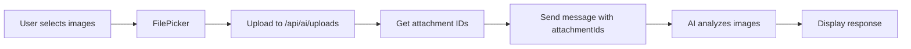

# Study Buddy - AI Assistant Module

> 🤖 An intelligent AI tutor powered by OpenAI GPT-4o-mini, featuring multi-modal conversations, web research, and image analysis.

[](https://flutter.dev)
[](https://nodejs.org)
[](https://www.mysql.com)
[](LICENSE)

---

## 📋 Table of Contents

- [Features](#-features)
- [Tech Stack](#-tech-stack)
- [Project Structure](#-project-structure)
- [Setup Instructions](#-setup-instructions)
- [API Endpoints](#-api-endpoints)
- [Usage Guide](#-usage-guide)
- [Database Schema](#-database-schema)
- [Troubleshooting](#-troubleshooting)
- [Contributing](#-contributing)

---

## ✨ Features

### 🤖 AI Chat
- ✅ **Multi-conversation support** - Create and manage multiple chat sessions
- ✅ **Persistent chat history** - All conversations saved to MySQL database
- ✅ **Auto-generated titles** - AI automatically names your chats based on content
- ✅ **Manual title editing** - Rename chats anytime with tap-to-edit

### 🖼️ Image Understanding
- ✅ **Multiple image upload** - Send multiple images in a single message
- ✅ **Image analysis** - AI can describe, analyze, and answer questions about images
- ✅ **Thumbnail preview** - See uploaded images before sending
- ✅ **Full-screen zoom** - Tap images to view in full screen with pinch-to-zoom

### 🔬 Research Mode
- ✅ **Web search integration** - AI searches the web using Tavily API
- ✅ **Source citations** - Every researched answer includes clickable sources
- ✅ **Real-time information** - Get current data beyond AI's knowledge cutoff

### 💅 Modern UI/UX
- ✅ **Markdown formatting** - Rich text with **bold**, *italic*, lists, `code blocks`
- ✅ **Optimistic updates** - Instant UI feedback while waiting for server
- ✅ **Swipe to delete** - Delete chats with confirmation dialog
- ✅ **Loading states** - Clear indicators for ongoing operations
- ✅ **Error handling** - Graceful fallbacks with user-friendly messages

---

## 🛠️ Tech Stack

<table>
<tr>
<td width="50%">

### Frontend


- `http` - API communication
- `shared_preferences` - Local token storage
- `file_picker` - Image/file selection
- `url_launcher` - Open research sources
- `flutter_markdown` - Rich text rendering
- `http_parser` - MIME type handling

</td>
<td width="50%">

### Backend


- `express` - REST API server
- `mysql2` - Database connection
- `openai` - GPT-4o-mini integration
- `jsonwebtoken` - Authentication
- `multer` - File upload handling

</td>
</tr>
</table>

---

## 📁 Project Structure
```
study_buddy/
├── frontend/ (Flutter)
│   ├── lib/
│   │   ├── screens/
│   │   │   ├── chat_list_screen.dart    # Chat list with create/delete
│   │   │   └── ai_tutor_screen.dart     # Chat conversation UI
│   │   └── services/
│   │       └── api_service.dart         # HTTP client & API methods
│   └── pubspec.yaml
│
└── backend/ (Node.js)
    ├── src/
    │   ├── config/
    │   │   └── db.js                    # MySQL connection
    │   ├── controllers/
    │   │   ├── conversationController.js # Chat CRUD + auto-title
    │   │   ├── messageController.js     # Messages + AI logic
    │   │   └── uploadController.js      # File uploads
    │   ├── routes/
    │   │   └── aiRoutes.js              # API route definitions
    │   └── middleware/
    │       └── authMiddleware.js        # JWT verification
    └── package.json
```

---

## 🚀 Setup Instructions

### Prerequisites

- [Flutter SDK](https://flutter.dev/docs/get-started/install) (3.0+)
- [Node.js](https://nodejs.org/) (18+)
- [MySQL](https://www.mysql.com/downloads/) (8.0+)
- [OpenAI API Key](https://platform.openai.com/api-keys)
- [Tavily API Key](https://tavily.com/) (for research mode)

<details>
<summary><b>📦 Backend Setup</b></summary>

### 1. Navigate to backend directory
```bash
cd study_buddy_backend
```

### 2. Install dependencies
```bash
npm install
```

### 3. Create `.env` file
```env
PORT=3000
DB_HOST=localhost
DB_USER=your_mysql_user
DB_PASSWORD=your_mysql_password
DB_NAME=study_buddy
JWT_SECRET=your_jwt_secret_key
OPENAI_API_KEY=sk-...
TAVILY_API_KEY=tvly-...
```

### 4. Set up MySQL database
```sql
CREATE DATABASE study_buddy;
USE study_buddy;

CREATE TABLE conversations (
  id INT PRIMARY KEY AUTO_INCREMENT,
  user_id INT NOT NULL,
  title VARCHAR(255) DEFAULT 'New Chat',
  created_at DATETIME DEFAULT CURRENT_TIMESTAMP,
  updated_at DATETIME DEFAULT CURRENT_TIMESTAMP ON UPDATE CURRENT_TIMESTAMP,
  is_archived BOOLEAN DEFAULT FALSE
);

CREATE TABLE messages (
  id INT PRIMARY KEY AUTO_INCREMENT,
  conversation_id INT NOT NULL,
  role ENUM('user', 'assistant') NOT NULL,
  text TEXT,
  created_at DATETIME DEFAULT CURRENT_TIMESTAMP,
  attachment_ids JSON,
  FOREIGN KEY (conversation_id) REFERENCES conversations(id)
);

CREATE TABLE attachments (
  id INT PRIMARY KEY AUTO_INCREMENT,
  conversation_id INT NOT NULL,
  file_path VARCHAR(500) NOT NULL,
  file_name VARCHAR(255) NOT NULL,
  mime_type VARCHAR(100),
  created_at DATETIME DEFAULT CURRENT_TIMESTAMP,
  FOREIGN KEY (conversation_id) REFERENCES conversations(id)
);
```

### 5. Start the server
```bash
npm start
```

✅ Server runs on `http://localhost:3000`

</details>

<details>
<summary><b>📱 Frontend Setup</b></summary>

### 1. Navigate to frontend directory
```bash
cd study_buddy_app
```

### 2. Install dependencies
```bash
flutter pub get
```

### 3. Update base URL (if needed)
In `lib/services/api_service.dart`:
```dart
final String baseUrl = "http://10.0.2.2:3000/api";  // Android emulator
// OR
final String baseUrl = "http://localhost:3000/api";  // iOS simulator
```

### 4. Run the app
```bash
flutter run
```

</details>

---

## 🔌 API Endpoints

### Conversations

| Method | Endpoint | Description | Auth Required |
|--------|----------|-------------|---------------|
| `POST` | `/api/ai/chats` | Create new chat | ✅ |
| `GET` | `/api/ai/chats` | List user's chats | ✅ |
| `GET` | `/api/ai/chats/:id` | Get chat details | ✅ |
| `POST` | `/api/ai/chats/:id/archive` | Archive/delete chat | ✅ |
| `POST` | `/api/ai/chats/:id/title` | Auto-generate or set title | ✅ |

### Messages

| Method | Endpoint | Description | Auth Required |
|--------|----------|-------------|---------------|
| `GET` | `/api/ai/chats/:id/messages` | Get chat messages | ✅ |
| `POST` | `/api/ai/chats/:id/messages` | Send message (text/images) | ✅ |

### Uploads

| Method | Endpoint | Description | Auth Required |
|--------|----------|-------------|---------------|
| `POST` | `/api/ai/uploads` | Upload image/file | ✅ |
| `GET` | `/api/ai/uploads/:id` | Retrieve attachment | ✅ |
| `DELETE` | `/api/ai/uploads/:id` | Delete attachment | ✅ |

---

## 📖 Usage Guide

<details>
<summary><b>💬 Creating a Chat</b></summary>

1. Tap the **+** button (FAB or AppBar)
2. Chat appears immediately with "New Chat" title
3. Start sending messages
4. Title auto-generates after first message

</details>

<details>
<summary><b>✉️ Sending a Message</b></summary>

1. Type your question in the text field
2. **(Optional)** Tap 📎 to attach images
3. Tap **Send** button
4. AI responds with formatted text

</details>

<details>
<summary><b>🔬 Using Research Mode</b></summary>

1. Tap the 🔬 **science icon** in the AppBar
2. Icon turns **yellow** when enabled
3. Ask questions requiring current information
4. AI searches the web and provides clickable sources

> **Note:** Research mode uses web search credits. Enable only when you need real-time data.

</details>

<details>
<summary><b>🖼️ Uploading Images</b></summary>

1. Tap the 📎 **attachment icon**
2. Select one or multiple images
3. Preview appears below text field
4. Tap **X** to remove individual images
5. Send with or without text
6. AI analyzes images and responds

**Supported formats:** JPG, PNG, GIF, WebP

</details>

<details>
<summary><b>✏️ Editing Chat Title</b></summary>

1. Tap the **chat title** in the AppBar
2. Enter new title in dialog
3. Tap **Save**
4. Title updates immediately

</details>

---

## 🗄️ Database Schema

### `conversations` Table
| Column | Type | Description |
|--------|------|-------------|
| `id` | INT (PK) | Auto-incrementing chat ID |
| `user_id` | INT (FK) | Owner of the chat |
| `title` | VARCHAR(255) | Chat title |
| `created_at` | DATETIME | Creation timestamp |
| `updated_at` | DATETIME | Last update timestamp |
| `is_archived` | BOOLEAN | Soft delete flag |

### `messages` Table
| Column | Type | Description |
|--------|------|-------------|
| `id` | INT (PK) | Auto-incrementing message ID |
| `conversation_id` | INT (FK) | Parent chat |
| `role` | ENUM | 'user' or 'assistant' |
| `text` | TEXT | Message content |
| `created_at` | DATETIME | Sent timestamp |
| `attachment_ids` | JSON | Array of attachment IDs |

### `attachments` Table
| Column | Type | Description |
|--------|------|-------------|
| `id` | INT (PK) | Auto-incrementing attachment ID |
| `conversation_id` | INT (FK) | Parent chat |
| `file_path` | VARCHAR(500) | Server file location |
| `file_name` | VARCHAR(255) | Original filename |
| `mime_type` | VARCHAR(100) | File type |
| `created_at` | DATETIME | Upload timestamp |

---

## 🔑 Key Implementation Details

<details>
<summary><b>🔐 Authentication Flow</b></summary>

1. User logs in → Backend returns JWT token
2. Token stored in `SharedPreferences`
3. `ApiService.loadAuthToken()` loads token on app start
4. Token sent in `Authorization: Bearer <token>` header
5. Backend `verifyToken` middleware validates all AI requests

</details>

<details>
<summary><b>⚡ Optimistic UI Updates</b></summary>

1. User taps "Create Chat" → Chat appears instantly with negative temp ID
2. Backend creates real chat → Returns real ID
3. Frontend polls `listChats()` to find new chat
4. Replaces temp ID with real ID
5. Spinner disappears, chat is ready

**Benefit:** Zero perceived latency for users

</details>

<details>
<summary><b>🏷️ Auto-Title Generation</b></summary>

1. User sends first message
2. Backend saves message
3. Backend calls OpenAI: "Generate a 6-word title for this conversation"
4. OpenAI returns title
5. Backend updates `conversations.title`
6. Frontend polls and displays new title

**Fallback:** If auto-title fails, chat keeps "New Chat" title

</details>

<details>
<summary><b>📤 Image Upload Flow</b></summary>


**MIME Type Detection:**
- `.jpg` / `.jpeg` → `image/jpeg`
- `.png` → `image/png`
- `.gif` → `image/gif`
- `.webp` → `image/webp`

</details>

---

## 🐛 Troubleshooting

<details>
<summary><b>❌ 401 Unauthorized Errors</b></summary>

**Symptoms:**
```
📥 listChats status: 401
📥 listChats body: {"error":"Access denied"}
```

**Causes:**
- Auth token not loaded
- Token expired
- Wrong SharedPreferences key

**Fixes:**
1. Ensure `ApiService.loadAuthToken()` is called in `main.dart`:
```dart
   void main() async {
     WidgetsFlutterBinding.ensureInitialized();
     await ApiService.loadAuthToken();  // ← Add this
     runApp(MyApp());
   }
```

2. Check token is loaded:
```dart
   print('🔑 Token: ${ApiService.authToken}');
```

3. Verify SharedPreferences key is `'authToken'` (not `'auth_token'`)

</details>

<details>
<summary><b>🖼️ Images Not Displaying</b></summary>

**Symptoms:**
- Gray boxes with broken image icon
- "No data" error

**Causes:**
- Auth token not passed to `getAttachment`
- Wrong attachment ID
- File deleted from server

**Fixes:**
1. Update `getAttachment` to use static `authToken`:
```dart
   if (authToken != null) 'Authorization': 'Bearer $authToken'
```

2. Check attachment IDs in database:
```sql
   SELECT * FROM attachments WHERE conversation_id = 123;
```

</details>

<details>
<summary><b>📁 File Upload Fails (application/octet-stream)</b></summary>

**Symptoms:**
```
Error: File type application/octet-stream not supported
```

**Cause:**
- MIME type not set correctly in multipart upload

**Fix:**
Add `http_parser` and set content type:
```dart
import 'package:http_parser/http_parser.dart';

request.files.add(
  await http.MultipartFile.fromPath(
    'file',
    filePath,
    contentType: MediaType.parse('image/jpeg'),  // ← Explicit type
  ),
);
```

</details>

<details>
<summary><b>🔌 Backend Not Receiving Requests</b></summary>

**Symptoms:**
- No logs in backend console
- Timeout errors in Flutter

**Causes:**
- Wrong base URL for emulator
- Backend not running
- Firewall blocking

**Fixes:**

| Platform | Correct Base URL |
|----------|------------------|
| Android Emulator | `http://10.0.2.2:3000/api` |
| iOS Simulator | `http://localhost:3000/api` |
| Physical Device | `http://YOUR_IP:3000/api` |

**Verify backend is running:**
```bash
curl http://localhost:3000/api/ai/chats
```

</details>

---

## 📦 Dependencies

<details>
<summary><b>Flutter Dependencies</b></summary>

Add to `pubspec.yaml`:
```yaml
dependencies:
  flutter:
    sdk: flutter
  http: ^1.1.0
  shared_preferences: ^2.2.2
  intl: ^0.19.0
  file_picker: ^8.0.0
  url_launcher: ^6.2.0
  flutter_markdown: ^0.7.4
  http_parser: ^4.0.2
```

Install:
```bash
flutter pub get
```

</details>

<details>
<summary><b>Node.js Dependencies</b></summary>

Add to `package.json`:
```json
{
  "dependencies": {
    "express": "^4.18.2",
    "mysql2": "^3.6.0",
    "openai": "^4.20.0",
    "jsonwebtoken": "^9.0.2",
    "multer": "^1.4.5-lts.1",
    "dotenv": "^16.3.1",
    "cors": "^2.8.5",
    "axios": "^1.6.0"
  }
}
```

Install:
```bash
npm install
```

</details>

---


---

## 📄 License

This project is part of the Study Buddy application.  
© 2024 Study Buddy Team. All rights reserved.

---

## 🙏 Acknowledgments

- [OpenAI](https://openai.com/) - GPT-4o-mini API
- [Tavily](https://tavily.com/) - Web search API
- [Flutter](https://flutter.dev/) - Mobile framework
- [Express.js](https://expressjs.com/) - Backend framework
- [MySQL](https://www.mysql.com/) - Database

---

## 📞 Support

**Having issues?** Check the [Troubleshooting](#-troubleshooting) section first.

**Still stuck?** Open an issue on GitHub with:
- Clear description of the problem
- Steps to reproduce
- Error messages/logs
- Screenshots (if applicable)

---

<div align="center">

**Last Updated:** November 15, 2024  
**Version:** 1.0.0 (AI Assistant Feature)

Made with ❤️ by the Study Buddy Team

</div>
For help getting started with Flutter development, view the
[online documentation](https://docs.flutter.dev/), which offers tutorials,
samples, guidance on mobile development, and a full API reference.
